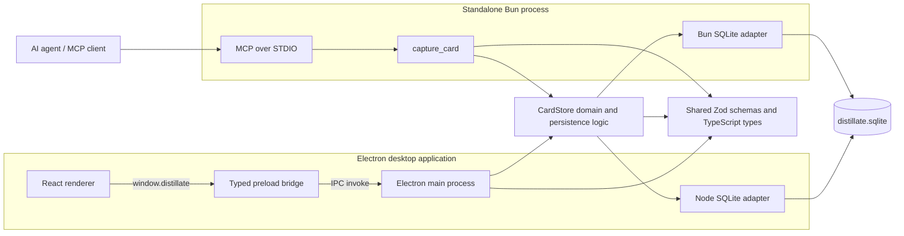
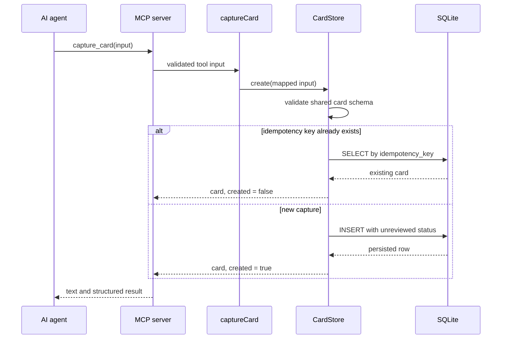
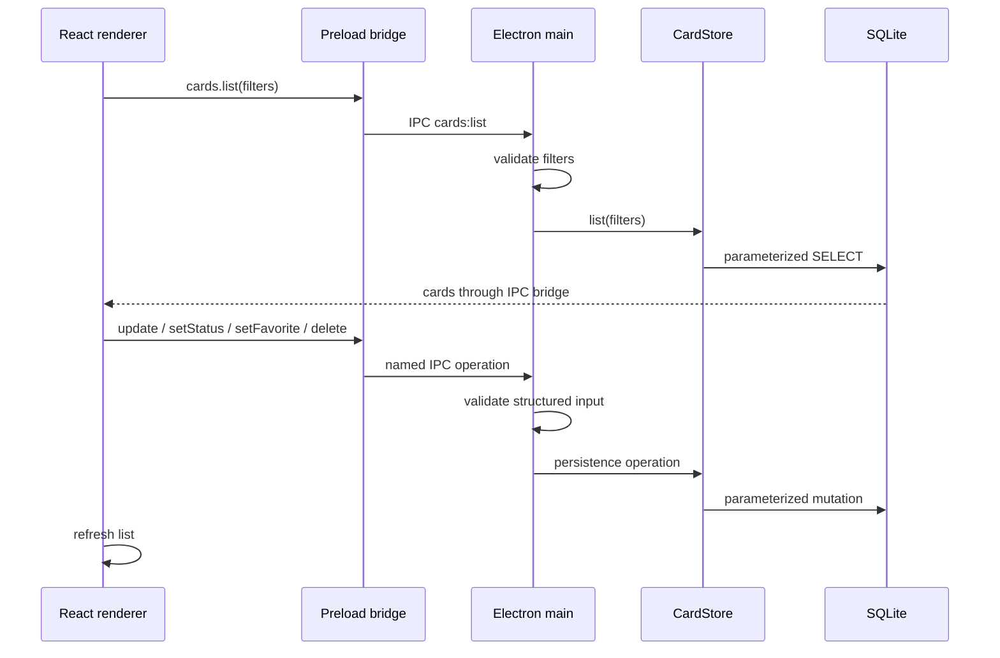
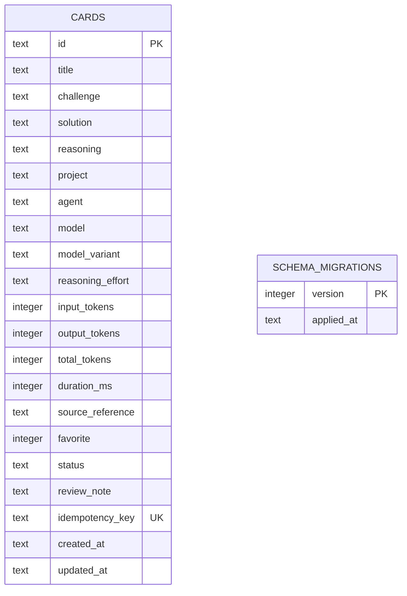

# Architecture

Distillate is a local-first desktop review queue. AI agents submit solved engineering challenges through an MCP server, and a single-user Electron application provides the review interface. Both processes share one SQLite database; no application server or network service sits between them.

## System overview



The diagram shows two runtime paths into the same storage behavior:

- The desktop path runs React in a sandboxed renderer. It can reach privileged functionality only through the API exposed by the preload script and handled by Electron main.
- The capture path runs as a standalone Bun process. It exposes one MCP tool over STDIO and does not require the desktop application to be open.
- `CardStore` owns migrations, queries, status changes, favorites, and idempotent creation. Small SQLite adapters isolate the Node and Bun database APIs.

## Component boundaries

| Area | Location | Responsibility |
| --- | --- | --- |
| Renderer | `src/renderer` | Display, search, filtering, pagination, editing, and review actions |
| Preload | `src/preload` | Expose the narrow, typed `window.distillate` API |
| Electron main | `src/main` | Window lifecycle, IPC validation, startup preference, and Node-backed store lifetime |
| MCP server | `src/mcp` | Validate `capture_card` requests, map MCP field names, and return tool results |
| Core | `src/core` | Database location, migrations, card persistence, and runtime-specific SQLite adapters |
| Shared | `src/shared` | Card schemas, TypeScript contracts, bridge types, and runtime constants |
| Skill bundle | `skill/distillate` | Teach compatible agents when and how to submit a review card |

Dependencies point inward: renderer and transport code depend on shared contracts and core behavior; core does not depend on Electron, React, or MCP.

## Capture flow



An optional idempotency key makes retries safe. New cards always enter the `unreviewed` state; review state is controlled through the desktop application.

## Review flow



The renderer refreshes on user actions, window focus, and a five-second interval so captures written by the independent MCP process become visible without coordinating the two processes directly.

## Persistence



The default database is `%LOCALAPPDATA%\Distillate\distillate.sqlite` on Windows and the platform data directory on other systems. `DISTILLATE_DATA_DIR` overrides the location for development and tests.

Each `CardStore` configures SQLite with WAL mode, a five-second busy timeout, and foreign-key enforcement. Schema migrations run transactionally when a store opens. WAL allows the MCP and desktop processes to use the same database without introducing a dedicated writer service.

## Trust and process boundaries

- The renderer has `nodeIntegration` disabled and runs with context isolation and sandboxing enabled.
- The preload exposes named card and preference operations rather than raw IPC or database access.
- Zod schemas validate external MCP input and Electron IPC payloads before persistence.
- SQL values are parameterized; only update column names selected from a fixed internal mapping are interpolated.
- Data remains local unless an MCP client or user deliberately copies it elsewhere.

## Build and verification

`electron-vite` builds separate main, preload, and renderer outputs. The preload is emitted as CommonJS because Electron sandboxed preload scripts do not support ESM. Bun runs the MCP entry point and the test suite, while Electron main uses Node's built-in SQLite implementation.

The main verification commands are:

```powershell
bun run typecheck
bun test
bun run build
```

Tests cover the shared store and migrations, MCP capture mapping and deduplication, preload/window configuration, and renderer behavior.
